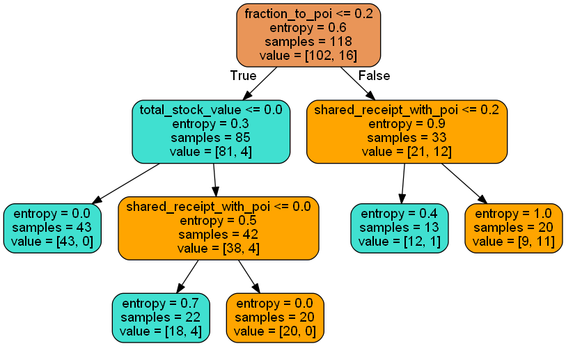
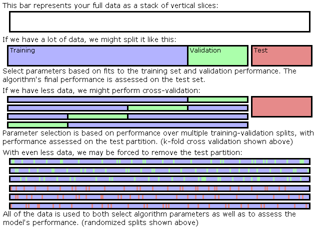

## Introduction
In 2000, Enron was one of the largest companies in the United States. By 2002,
it had collapsed into bankruptcy due to widespread corporate fraud. In the
resulting Federal investigation, a significant amount of typically confidential
 information entered into the public record, including tens of thousands of
 emails and detailed financial data for top executives.
 In this project, based on the public Enron financial and email dataset, I built
  machine learning algorithms to identify Enron Employees who may have committed
   fraud (who are called persons of interest, POI, in the following).

More specifically, a dataset of persons and features associated with them is
given, and then the goal is to build a classifier algorithm around it that can
predict if individuals should be flagged as POIs or not. This dataset consists
of 146 observations and 21 features.

## Data exploration
The aggregated Enron email & financial dataset is stored in a dictionary,
where each key-value pair in the dictionary corresponds to one person. The
dictionary key is the person's name, and the value is another dictionary, which
contains the names of all the features and their values for that person. The
 features in the data fall into three major types:

>1. financial features (14 in total): e.g `salary`, `loan_advances`, `bonus`,
 etc (all units are in US dollars).
>2. email features (6 in total): the number of emails received (`to_messages`),
the number of emails from POI (`from_poi_to_this_person`), etc (units are
  generally number of email messages)
>3. POI label (1 is for POI, and 0 is for non-POI)

In short, features are input; label is output that the model is going to
predict.

A brief overview of the dataset:
1. It includes the information of 146 people.
2. Among them, there are 18 POI (person of interest) and 128 non-POI,
respectively.
3. For each person, 21 features and corresponding values are available.

## Outliers investigation
To identify the outliers, I start looking at the salary and bonus of each
person in this dataset. From the scatter plot, I found that a person's salary
is generally proportion to his/her bonus. In addition, POIs and non-POIs are
labeled with red and blue dots, respectively. However, a non-POI point at the
top right corner appears to be unusually distant from the rest of the data.

  

Who is this person? Using a list comprehension [1], "total" is
identified to be this distinct observation! It is neither a POI or non-POI.
Rather, it is likely a spreadsheet quirk since the spreadsheet added up all the
 data points automatically as it was generated.

After this removal, I look into the remaining data points again. Data having
salary larger than $1,000,000 or bonus more than $5,000,000 are considered as
outliers. A vertical and horizontal line are drawn, respectively, to assist the
identification.

  

Five points fall into this category in which either salary is higher than
$1,000,000 or bonus is more than $5,000,000. Based on the coloration, three of
these five points are people of interest (red dots). Using a list comprehension,
 the names corresponding to the outliers are:
1. John J Lavorato
2. Kenneth L Lay
3. Timothy N Belden
4. Jeffrey K Skilling
5. Mark A Frevert

It turns out that Kenneth L Lay is the former chairman and CEO, Jeffrey Skilling
 is the former president and COO, and Timothy N Belden is the former head of
 trading in Enron. Three of them are definitely people of interest. However, the
  other two people, i.e., John J Lavorato and Mark A  Frevert seem to be
  outliers and we may remove them to improve the modeling  accuracy if
  necessary.

## Feature selection and optimization
As POIs, they might have particularly strong email connections between each
other. In other words, they send each other emails at a higher rate than people
in the population at large who send emails to POIs. Two new features are
therefore defined to measure the strength of the email connections, which are:

● Percentage of emails from POIs to this person (%) = # emails from POI to this
person / # emails to this person

● Percentage of emails from this person to POIs (%) = # emails from this person
to POI / # emails from this person

These two features are visualized in the figure below and POIs are red while
non-POIs are blue.

  

To figure out the importance of each feature which is either financial or email
features, SelectKBest (a univariate feature selection) is used. Note that
`email_address` is not included since it contains text strings, and `other` is
not used either since this feature is not clearly defined. In addition,
MinMaxScaler is deployed to scale each feature to the range between 0 and 1, and
SelectKBest ranks the features according to f_classif, which represents ANOVA
F-value (the linear dependency between each feature and label) [2, 3] between
label and features.

  

Few observations:
1. The difference between the max and min score is roughly an order of magnitude.
2. The financial features in general have higher ranking than email features.
3. One of the new features "Percentage of emails from this person to POIs (%)"
(`fraction_to_poi`) is ranked 5th.

## Algorithms
Decision Tree and Logistic Regression are set as classifier to build the model
using 21 features. The result is formatted in the table below.

|   |Decision Tree   | Logistic Regression  |
|---|---|---|
| Accuracy  |0.81|0.78|
| Precision  |0.29|0.17|
| Recall  |0.27|0.17|

Since the label is a binary variable, intuitively I would assume logistic
regressions shall give a better performance even without tuning the parameters.
However, it is found that decision tree outperforms logistic regression in this
 case. The precision and recall for logistic regression are particularly low.
 Thus, in the following, the decision tree is chosen to tune parameters.

## Tuning parameters
Machine learning have parameters that require tuning in order to get the best
performance. GridCVSearch and Pipeline are used to expedite the parameters
optimization [4, 5].

GridSearchCV is a way of systematically working through multiple combinations of
 parameter tunes, cross-validating as it goes to determine which tune gives the
 best performance. The beauty is that it can work through many combinations in
 only a couple extra lines of code.

Pipleline is not an algorithm but a tool encapsulating multiple different
transformers alongside an estimator into one object that can be cross-validated
together while setting different parameters. [6, 7]

More specifically, F1 score (the harmonic average of the precision and recall)
is employed to evaluate the performance and StratifiedShuffleSplit (using
  stratified sampling) is the cross-validator.

The first parameter to tune is the optimal number of features.

Given the classifier is the decision tree with all the default setting, the
optimal number of features is found to be 6, when no optimization of the
decision tree is employed. Accuracy, Precision and Recall all show improvement
with the number of features is reduced from 21 to 6, shown in the bar chart
below [8]:

  

The minimum requirement of the performance is to have both precision and recall
larger than 0.3, and a blue line is added on the chart representing this
threshold. Accuracy improves slightly: 0.81 to 0.82, but both precision and
recall improve quite a bit. Precision increases from 0.29 to 0.37, and recall
from 0.27 to 0.39. The model performance has passed the threshold before
the parameter of the decision tree is optimized!

The 6 selected features are:
>1. `exercised_stock_options`
>2. `total_stock_value`
>3. `bonus`
>4. `salary`
>5. `fraction_to_poi`
>6. `shared_receipt_with_poi`

Note that the first five selected are the top five in F-value ranking, while
the sixth `shared_receipt_with_poi` is not. In addition, the new feature
`fraction_to_poi` is included in this selection.

Now, we begin to optimize and tune the parameters for the decision tree,
including:

1. criterion: gini or entropy
2. maximum depth
3. maximum leaf nodes
4. minimum samples leaf
5. minimum samples split

A further optimization on the parameters of the decision tree results in the
improvement on the precision as well as the recall seen in the updated bar
chart.

  

And the corresponding decision tree looks like this [9]:

  

Parameter setting that corresponds to the optimal tree:

>1. criterion: entropy
>2. maximum depth: None
>3. maximum leaf nodes: 5
>4. minimum samples leaf: 10
>5. minimum samples split: 2

It shall be noted that for this tree, it is a really short one. In addition,
`fraction_to_poi` is a root node, and secondary branches nodes are
 `total_stock_value` and `shared_receipt_with_poi`. Although the result is
 simpler than I expected, I do like a simple solution!

## Model Validation and Performance
Model validation is critical for building new models, through which we can find
out how well this model performs, and prevent the overfitting. In a common
practice, a major part of the dataset is selected to train the model and a small
 portion of dataset is reserved to test the model. Thus, the model would be
 tested by the data which it has not seen before, and the estimate would be
 fairer. I used sklearn's train_test_split function to split 30% of the data
 into a test set, and 70% into a training set.

After the data is split for training and testing use. A k-fold cross-validation
is applied to further split the training data set to derive an optimal parameter
 setting. [10] A picture from the same source explains this nicely.

 

   
 

What is k-fold cross-validation? "The original sample is randomly partitioned
into k equal sized subsamples. Of the k subsamples, a single subsample is
retained as the validation data for testing the model, and the remaining k − 1
subsamples are used as training data. The cross-validation process is then
repeated k times, with each of the k subsamples used exactly once as the
validation data. The k results can then be averaged to produce a single
estimation." [11] As mentioned previously, the cross-validator is
StratifiedShuffleSplit which uses stratified sampling.

To evaluate the performance of the model, accuracy, precision and recall are
used.

● Accuracy = # of items in a class labeled correctly / all items in that class    
= # of people labeled as POI or non-POI correctly / all the people

Accuracy is not sufficient to fully capture the performance because this is an
imbalanced classification problem. I have two classes that need to identify 
— POIs and non-POIs, and non-POIs represents the overwhelming majority of the
data points over POIs. So even if I assume everyone is non-POIs, I can achieve
87% accuracy (128/146). However, it is not a very useful model, because it will
never tell me when a person will commit financial crime, which is what we really
are interested in. Two additional metrics are therefore introduced, which are
precision and recall. Their definitions are as follows: [12]

● Precision = true positive / all predicted positive  
= # of POIs labeled correctly / # of people labeled as POIs

● Recall = true positive / all actual positive  
= # of people labeled as POI correctly / # of POIs

In short, precision express the proportion of the data points our model says
were relevant actually were relevant, while recall expresses a model’s ability
to find all the data points of interest in a dataset.

In the bar charts presented earlier, accuracy, precision and recall are all
included to evaluate the models during the progression of optimization.

Lastly, here is the optimal result that I got in this study:

|   |Decision Tree   |
|---|---|
| Accuracy  |0.84|
| Precision  |0.46|
| Recall  |0.48|

## Reflection
This machine learning project has a quite steep learning curve but overall it is
 a very rewarding experience. I got the hands-on experience on these up-to-date
 machine learning techniques, including outliers detection, feature selection,
setting up the pipeline, model optimization, model validation and performance
evaluation. After many struggles, it is quite excited to see when all of these
pieces eventually work together.

## References
1. [Outliers](https://discussions.udacity.com/t/encore-des-outliers-2nd-last-part-of-the-outliers-section/31747)
2. [What do these f scores mean?](https://stackoverflow.com/questions/49214001/what-do-these-f-scores-mean-using-selectkbest-feature)
3. [Feature Selection at scikit-learn](http://scikit-learn.org/stable/modules/feature_selection.html#univariate-feature-selection)
4. [Find out the features by SelectKBest](https://discussions.udacity.com/t/how-to-find-out-the-features-selected-by-selectkbest/45118)
5. [How to use pipeline for scaling](https://discussions.udacity.com/t/how-to-use-pipeline-for-feature-scalling/164178)
6. [Pipeline at scikit-learn](http://scikit-learn.org/stable/modules/generated/sklearn.pipeline.Pipeline.html)
7. [Pipeline at stackoverflow](https://stackoverflow.com/questions/33091376/python-what-is-exactly-sklearn-pipeline-pipeline)
8. [Grouped barplot](https://python-graph-gallery.com/11-grouped-barplot/)
9. [Plot decision tree](https://stackoverflow.com/questions/42891148/changing-colors-for-decision-tree-plot-created-using-export-graphviz)
10. [GridSearchCV, testing and training split](https://discussions.udacity.com/t/gridsearchcv-and-testingtraining-data/36107)
11. [Cross-Validation at wikipedia](https://en.wikipedia.org/wiki/Cross-validation_(statistics))
12. [Beyond accuracy](https://towardsdatascience.com/beyond-accuracy-precision-and-recall-3da06bea9f6c)
